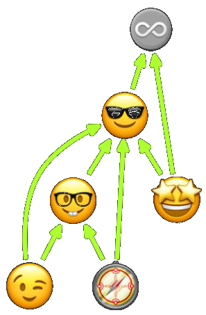

# Some Stuff ...
... lab & hub

1. Awesome Graphviz: [gitpage](https://codefreezr.github.io/awesome-graphviz/)
1. ChaosLab: [homepage](https://codefreezr.gitlab.io/chaoslab/)
1. KoalA: KoalitionsvertragsAnalyse [slide-deck](https://mypub4u.gitlab.io/koalas/)
1. LifeLongLearning: [blog (e)](https://codefreezr.gitlab.io/lifelonglearning/en/),  [blog (de)](https://codefreezr.gitlab.io/lifelonglearning/de/), [repo](https://gitlab.com/codefreezr/lifelonglearning)
1. 100DaysOfCode: [R1](https://gitlab.com/codefreezr/100-days-of-code/blob/master/r1-log.md), [R2](https://gitlab.com/codefreezr/100-days-of-code/blob/master/r2-log.md), [R3](https://gitlab.com/codefreezr/100-days-of-code/blob/master/r3-log.md), [R4](https://gitlab.com/codefreezr/100-days-of-code/blob/master/r4-log.md)
1. Go By Examples: [gobeys](http://bit.ly/git-gobyes)  
1. FaaS-Lane: [faas-lane project](https://github.com/faas-lane), [FaaS-Landscape](https://github.com/faas-lane/FaaS-Lane/tree/master/candidates)
1. RosettaCode by Nmbrs: [Categories & Graph](https://codefreezr.github.io/rosettacode-by-nmbrs/)
1. Awesome LearnRwithR: [gitpage (wip)](https://codefreezr.github.io/awesome-LearnRwithR/)
---  

# lab-of-labs ...
... collect all my untidy codelabs

1. api-lab 
1. blender-lab [gitlab-repo](https://gitlab.com/codefreezr/blenderlab)
1. chaos-lab [gitlab-repo](https://gitlab.com/codefreezr/chaoslab)
1. go-lab 
1. graphi-lab 
1. gro-lab 
1. hugo-lab 
1. jenkins-lab 
1. kube-lab 
1. masterpieces [gitlab-repo](https://gitlab.com/codefreezr/masterpieces)
1. r-lab [gitlab-repo](https://gitlab.com/codefreezr/r-lab)
1. rosettacode-to-go 
1. rosettacode-by-nmbrs 
1. snippets 
1. twitterei 
1. vue-lab 
